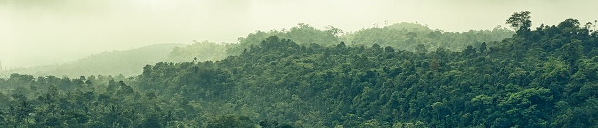
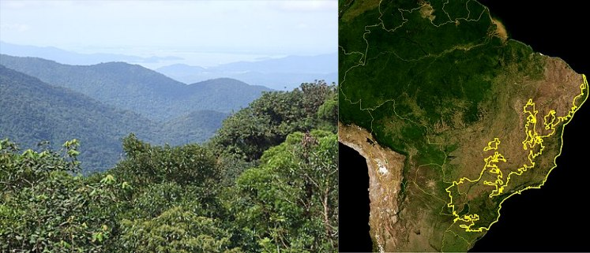
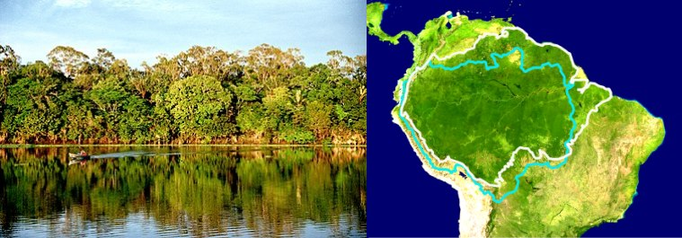

# Forest-Watch - Sons da Amazônia

## Forest Watch - Rainforest monitoring data science research project

Forest Watch research project aims to collect images and sound data from Brazilian forests, [Amazon](https://en.wikipedia.org/wiki/Amazon_rainforest) and [Mata Atlântica](https://en.wikipedia.org/wiki/Atlantic_Forest), to analyze and monitor biodiversity, risks, and threads such as fire, shots, and illegal activities such as logging, and poaching.

Concept:

- Prototype data collection device
  - Off grid (solar painel power source)
  - Reporposed used smartphones
  - Lightweight case
  - Ping device on top of trees
  - Send data by 4G/5G
  - Mobile app to get sensors info
- Store sound data
- Analise sound data at the cloud
- Report
  - Mogile app
  - Papers
  - Graphics/Dashboard
  - Online real time data access 

Researchers:

### MEng. Daniel Carvalho - Insper and Wolfram Research
- https://www.linkedin.com/in/danielscarvalho/
-  http://lattes.cnpq.br/0474323108499042

### Dr. Seimor Walchhutter - Universidade Federal de Rondônia
- https://www.linkedin.com/in/seimor-walchhutter-5a3844186/
- http://lattes.cnpq.br/7714262057936175

### Dr. Daniel Hoffmman - Universidade Estadual do Rio Grande do Sul
- http://lattes.cnpq.br/4388320562511213

Mata Atlântica - 200,205.3 km2

Amazonia - 7,000,000 km2

Project inspired by:
- https://rfcx.org
- https://www.eff.org/pages/gunshot-detection
- https://www.shotspotter.com/

### Bibliograpy:

- The Great Animal Orchestra: Finding the Origins of Music in the World's Wild Places
by Bernie Krause, Little Brown, 2012.
- Methods in Ecoacoustics: The Acoustic Complexity Indices by Almo Farina, Peng Li, Springer, 2021
- Introduction to Machine Learning by Etienne Bernard, Wolfram Media, 2022
- Beginning Mathematica and Wolfram for Data Science: Applications in Data Analysis, Machine Learning, and Neural Networks 1st ed. Edition
by Jalil Villalobos Alva, Apress, 2021
- Mathematica for Bioinformatics: A Wolfram Language Approach, George Mias, Springer, 2018.
- 

### Related News:

Archaeologists find vast network of Amazon villages laid out like the cosmo 
https://www.livescience.com/clock-face-shaped-villages-amazon-rainforest.html
